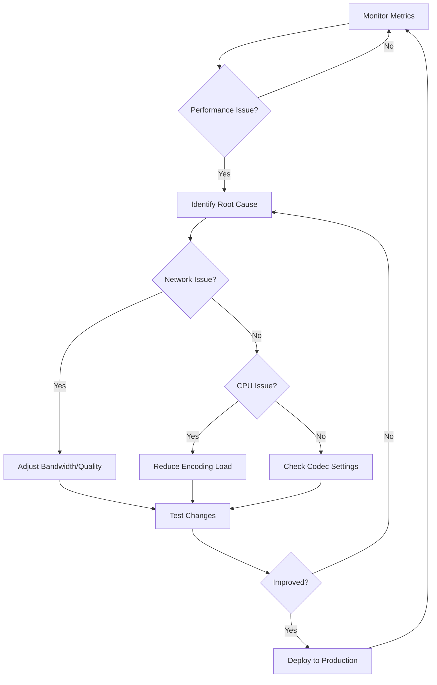

# WebRTC Performance Implementation Guide for Fethur

## Executive Summary

This document provides comprehensive guidance for implementing and maintaining high-performance WebRTC communication in the Fethur platform. Based on extensive research of current best practices (2024-2025), this guide focuses on achieving optimal balance between performance and quality while maintaining system scalability.

## Table of Contents

1. [Core Performance Strategies](#core-performance-strategies)
2. [Codec Selection and Configuration](#codec-selection-and-configuration)
3. [Network Optimization Techniques](#network-optimization-techniques)
4. [Implementation Architecture](#implementation-architecture)
5. [Quality Management System](#quality-management-system)
6. [Performance Monitoring](#performance-monitoring)
7. [Maintenance Guidelines](#maintenance-guidelines)
8. [Testing and Validation](#testing-and-validation)

## Core Performance Strategies

### 1. Simulcast Implementation

Simulcast is the cornerstone of efficient WebRTC communication at scale. It involves sending multiple video streams at different qualities simultaneously.

**Recommended Configuration:**
```javascript
// Three-layer simulcast configuration
const simulcastEncodings = [
  {
    rid: 'low',
    active: true,
    maxBitrate: 100000,    // 100 kbps
    scaleResolutionDownBy: 4
  },
  {
    rid: 'medium',
    active: true,
    maxBitrate: 300000,    // 300 kbps
    scaleResolutionDownBy: 2
  },
  {
    rid: 'high',
    active: true,
    maxBitrate: 900000     // 900 kbps
  }
];
```

### 2. Adaptive Bitrate Strategy

Implement dynamic bitrate adaptation based on network conditions:

- **Initial Conservative Approach**: Start with medium quality and scale up
- **Packet Loss Threshold**: Switch to lower quality at >2% packet loss
- **CPU Monitoring**: Reduce quality when CPU usage exceeds 70%
- **Bandwidth Estimation**: Use Transport-wide Congestion Control (TWCC)

### 3. SVC (Scalable Video Coding) Preparation

While simulcast is the current standard, prepare for future SVC adoption:
- **VP9 SVC**: Available now but CPU-intensive
- **AV1 SVC**: Future-proof option with best compression
- **Hybrid Approach**: Use AV1 for lowest bitrate layer (CPU-efficient at low bitrates)

## Codec Selection and Configuration

### Primary Codec: VP9

**Rationale:**
- 30-40% better compression than VP8
- Good hardware support in modern devices
- Temporal scalability support
- Wide browser compatibility

**Configuration:**
```go
// VP9 configuration for Go server
codecConfig := CodecConfig{
    Name: "VP9",
    ClockRate: 90000,
    Channels: 0,
    SDPFmtpLine: "profile-id=0",
    PayloadType: 98,
    // Enable temporal scalability
    TemporalLayers: 3,
    SpatialLayers: 1,
}
```

### Fallback Codec: VP8

Use VP8 for legacy device support:
```go
vp8Config := CodecConfig{
    Name: "VP8",
    ClockRate: 90000,
    PayloadType: 96,
    // VP8 supports 2 temporal layers by default
    TemporalLayers: 2,
}
```

### Audio Codec: Opus

**Configuration:**
```go
opusConfig := AudioCodecConfig{
    Name: "opus",
    ClockRate: 48000,
    Channels: 2,
    // Optimize for voice
    SDPFmtpLine: "minptime=10;useinbandfec=1;stereo=0",
    // Adaptive bitrate 6-510 kbps
    MinBitrate: 6000,
    MaxBitrate: 32000,  // 32 kbps for voice
}
```

## Network Optimization Techniques

### 1. TURN Server Optimization

```yaml
# Optimized TURN server configuration
turn:
  - urls: "turn:turn.fethur.com:3478"
    username: "user"
    credential: "pass"
  - urls: "turn:turn.fethur.com:443?transport=tcp"
    username: "user"
    credential: "pass"
```

### 2. Jitter Buffer Configuration

```javascript
// Client-side jitter buffer tuning
const pcConfig = {
  iceServers: [...],
  bundlePolicy: 'max-bundle',
  rtcpMuxPolicy: 'require',
  // Optimize for low latency
  sdpSemantics: 'unified-plan'
};

// Set jitter buffer target
pc.getReceivers().forEach(receiver => {
  if (receiver.track.kind === 'video') {
    const params = receiver.getParameters();
    receiver.jitterBufferTarget = 100; // 100ms for low latency
  }
});
```

### 3. Bandwidth Management

**Recommended Limits:**
- **Upload**: 1.2 Mbps (3 simulcast layers)
- **Download**: 3-4 Mbps (for 7x7 grid view)
- **Per-participant limit**: 50-80 kbps for small tiles

### 4. Network Adaptation Algorithms

```go
// Server-side bandwidth estimation
type BandwidthEstimator struct {
    targetBitrate    int
    availableBitrate int
    packetLoss      float64
    rtt             time.Duration
}

func (be *BandwidthEstimator) AdaptQuality() string {
    if be.packetLoss > 0.05 || be.availableBitrate < 150000 {
        return "low"
    } else if be.packetLoss > 0.02 || be.availableBitrate < 400000 {
        return "medium"
    }
    return "high"
}
```

## Implementation Architecture

### 1. Client-Side Architecture

```javascript
class WebRTCManager {
    constructor() {
        this.simulcastConfig = {
            video: {
                enabled: true,
                layers: 3,
                adaptiveBitrate: true
            },
            audio: {
                echoCancellation: true,
                noiseSuppression: true,
                autoGainControl: true
            }
        };
    }

    async setupPeerConnection() {
        const pc = new RTCPeerConnection(this.pcConfig);
        
        // Enable simulcast
        const transceiver = pc.addTransceiver('video', {
            direction: 'sendrecv',
            streams: [localStream],
            sendEncodings: this.getSimulcastEncodings()
        });
        
        // Monitor connection stats
        this.startQualityMonitoring(pc);
        
        return pc;
    }

    startQualityMonitoring(pc) {
        setInterval(async () => {
            const stats = await pc.getStats();
            this.analyzeAndAdapt(stats);
        }, 1000);
    }
}
```

### 2. Server-Side Architecture

```go
// SFU implementation with simulcast support
type SFU struct {
    router      *Router
    transports  map[string]*WebRTCTransport
    bandwidthEstimator *BandwidthEstimator
}

func (s *SFU) HandleSimulcastLayer(
    participantID string, 
    requestedQuality string,
) error {
    transport := s.transports[participantID]
    
    // Validate available bandwidth
    if !s.bandwidthEstimator.CanSupportQuality(requestedQuality) {
        requestedQuality = s.bandwidthEstimator.GetOptimalQuality()
    }
    
    // Switch simulcast layer
    return transport.SelectSimulcastLayer(requestedQuality)
}
```

## Quality Management System

### 1. Dynamic Quality Profiles

```javascript
const qualityProfiles = {
    'presentation': {
        video: { width: 1920, height: 1080, frameRate: 30 },
        priority: 'resolution'
    },
    'conversation': {
        video: { width: 640, height: 360, frameRate: 30 },
        priority: 'framerate'
    },
    'screenshare': {
        video: { width: 1920, height: 1080, frameRate: 5 },
        priority: 'sharpness'
    }
};
```

### 2. Automatic Quality Adaptation

```javascript
class QualityController {
    constructor() {
        this.metrics = {
            packetLoss: 0,
            jitter: 0,
            rtt: 0,
            availableBandwidth: 0
        };
    }

    async adaptQuality() {
        const score = this.calculateQualityScore();
        
        if (score < 0.5) {
            // Switch to lower quality
            await this.switchToLowerQuality();
        } else if (score > 0.8 && this.canUpgrade()) {
            // Try higher quality
            await this.switchToHigherQuality();
        }
    }

    calculateQualityScore() {
        // Weighted scoring based on network metrics
        const plScore = 1 - Math.min(this.metrics.packetLoss * 20, 1);
        const jitterScore = 1 - Math.min(this.metrics.jitter / 100, 1);
        const rttScore = 1 - Math.min(this.metrics.rtt / 400, 1);
        
        return (plScore * 0.5 + jitterScore * 0.3 + rttScore * 0.2);
    }
}
```

## Performance Monitoring

### 1. Key Performance Indicators (KPIs)

Monitor these metrics continuously:

- **Video Quality**
  - Resolution delivered vs requested
  - Frame rate consistency
  - Bitrate stability
  - Freeze events per minute

- **Network Performance**
  - RTT (Round Trip Time) < 150ms
  - Packet loss < 1%
  - Jitter < 30ms
  - Bandwidth utilization efficiency

- **System Performance**
  - CPU usage < 60%
  - Memory usage < 200MB per participant
  - GPU acceleration utilization

### 2. Monitoring Implementation

```go
type PerformanceMonitor struct {
    metrics map[string]*SessionMetrics
    alerts  chan Alert
}

type SessionMetrics struct {
    VideoQuality    QualityMetrics
    NetworkStats    NetworkMetrics
    ResourceUsage   ResourceMetrics
    UserExperience  UXMetrics
}

func (pm *PerformanceMonitor) CollectMetrics(sessionID string) {
    metrics := &SessionMetrics{
        VideoQuality: pm.measureVideoQuality(sessionID),
        NetworkStats: pm.measureNetworkPerformance(sessionID),
        ResourceUsage: pm.measureResourceUsage(sessionID),
        UserExperience: pm.calculateMOS(sessionID), // Mean Opinion Score
    }
    
    pm.metrics[sessionID] = metrics
    pm.checkThresholds(metrics)
}
```

### 3. Real-time Dashboard

```javascript
// Client-side metrics collection
class MetricsCollector {
    async collectAndReport() {
        const stats = await this.pc.getStats();
        
        const metrics = {
            timestamp: Date.now(),
            video: {
                bytesSent: 0,
                bytesReceived: 0,
                packetsLost: 0,
                framesDecoded: 0,
                framesDropped: 0
            },
            network: {
                rtt: 0,
                jitter: 0,
                availableOutgoingBitrate: 0
            }
        };
        
        // Parse WebRTC stats
        stats.forEach(report => {
            if (report.type === 'inbound-rtp' && report.mediaType === 'video') {
                metrics.video.bytesReceived = report.bytesReceived;
                metrics.video.packetsLost = report.packetsLost;
                metrics.video.framesDecoded = report.framesDecoded;
            }
            // ... parse other stats
        });
        
        // Send to monitoring server
        this.sendMetrics(metrics);
    }
}
```

## Maintenance Guidelines

### 1. Regular Performance Audits

**Weekly Tasks:**
- Review aggregate quality metrics
- Identify problematic network paths
- Analyze codec performance distribution
- Check TURN server utilization

**Monthly Tasks:**
- Bandwidth usage analysis
- Codec efficiency comparison
- Client capability distribution review
- Infrastructure capacity planning

### 2. Update and Patch Management

```yaml
# Maintenance schedule
maintenance:
  webrtc_stack:
    - check_interval: weekly
    - security_patches: immediate
    - feature_updates: monthly
    
  codecs:
    - vp9_updates: quarterly
    - opus_updates: biannually
    
  infrastructure:
    - turn_servers: monthly
    - sfu_updates: monthly
    - monitoring_tools: quarterly
```

### 3. Performance Optimization Workflow



### 4. Troubleshooting Guide

**Common Issues and Solutions:**

1. **High Packet Loss**
   - Enable FEC (Forward Error Correction)
   - Reduce video quality temporarily
   - Switch to TCP TURN relay if needed

2. **CPU Overload**
   - Limit simultaneous decoders
   - Use hardware acceleration
   - Reduce incoming stream quality

3. **Bandwidth Constraints**
   - Enable aggressive simulcast layer switching
   - Implement participant limits
   - Use lower-quality audio codec settings

## Testing and Validation

### 1. Network Condition Simulation

```bash
# Test various network conditions
# Using tc (traffic control) on Linux

# Simulate 3G network
sudo tc qdisc add dev eth0 root netem delay 150ms 50ms loss 2%

# Simulate congested network
sudo tc qdisc add dev eth0 root tbf rate 500kbit burst 32kbit latency 100ms

# Simulate satellite connection
sudo tc qdisc add dev eth0 root netem delay 600ms 100ms loss 0.5%
```

### 2. Load Testing

```javascript
// Automated load testing script
class LoadTester {
    async runTest(config) {
        const participants = [];
        
        // Spawn virtual participants
        for (let i = 0; i < config.participantCount; i++) {
            const participant = await this.createVirtualParticipant({
                video: config.enableVideo,
                audio: config.enableAudio,
                simulcast: config.enableSimulcast
            });
            participants.push(participant);
        }
        
        // Collect metrics during test
        const metrics = await this.collectMetrics(config.duration);
        
        // Generate report
        return this.generateReport(metrics);
    }
}
```

### 3. Quality Validation

```go
// Server-side quality validation
type QualityValidator struct {
    targetMOS float64  // Mean Opinion Score target
}

func (qv *QualityValidator) ValidateSession(metrics SessionMetrics) bool {
    mos := qv.calculateMOS(metrics)
    
    return mos >= qv.targetMOS && 
           metrics.VideoQuality.FreezeCount < 5 &&
           metrics.NetworkStats.PacketLoss < 0.02
}
```

## Best Practices Summary

1. **Start Conservative**: Begin with lower quality and scale up
2. **Monitor Constantly**: Real-time metrics are crucial
3. **Adapt Dynamically**: Respond to changing conditions quickly
4. **Test Extensively**: Cover all network conditions and devices
5. **Plan for Scale**: Design for 10x current usage
6. **Document Everything**: Maintain clear operational procedures

## Future Considerations

### 1. Emerging Technologies

- **AV1 Codec**: Prepare for 50% better compression
- **Machine Learning**: Implement ML-based quality prediction
- **5G Networks**: Optimize for ultra-low latency scenarios
- **WebTransport**: Consider migration from WebRTC DataChannels

### 2. Scalability Roadmap

```yaml
scalability_milestones:
  phase1:
    participants: 100
    infrastructure: "Single region SFU"
    
  phase2:
    participants: 1000
    infrastructure: "Multi-region SFU cluster"
    features: ["Cascading SFU", "Regional routing"]
    
  phase3:
    participants: 10000
    infrastructure: "Global mesh network"
    features: ["Edge computing", "Anycast routing"]
```

## Conclusion

Implementing efficient WebRTC communication requires careful attention to codec selection, network optimization, and continuous monitoring. By following this guide and maintaining focus on real-world performance metrics, the Fethur platform can deliver high-quality, reliable real-time communication at scale.

For questions or clarifications about this implementation guide, consult the WebRTC team or refer to the additional resources in the appendix.