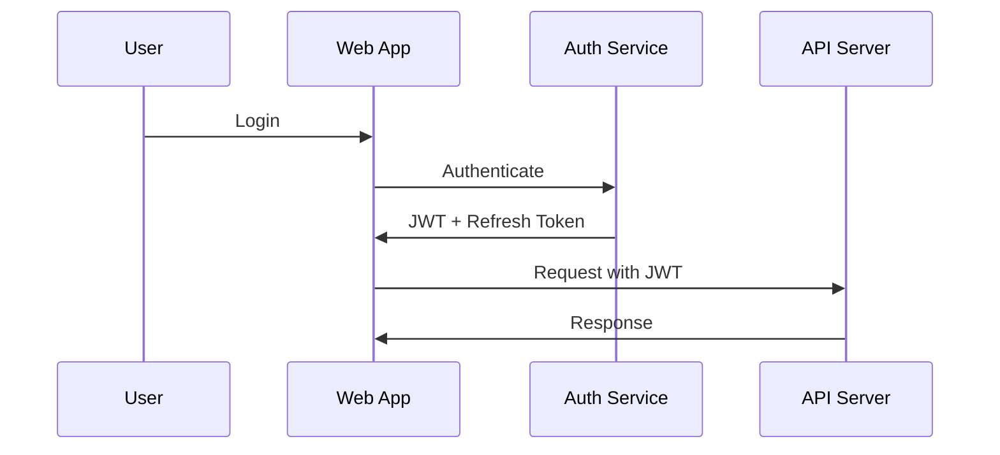

# Feathur Web Client Architecture

This document outlines two architecture options for the Feathur web client: a self-hosted model and a cloud-based future model.

## Overview

Both options share a common base SvelteKit client that provides:
- Real-time messaging with WebSocket support
- User authentication and account management
- Server and channel management
- Modern, responsive UI with Tailwind CSS
- Progressive Web App (PWA) capabilities

## Option 1: Self-Hosted Model

### Architecture Overview

The self-hosted model embeds the web interface directly into the Go binary, creating a single executable that serves both the API and the web interface.

```
┌─────────────────────────────────────────────┐
│           Single Go Binary                  │
├─────────────────────────────────────────────┤
│  ┌───────────────┐    ┌─────────────────┐  │
│  │  Web Server   │    │   API Server    │  │
│  │  (Port 8080)  │    │   (Same Port)   │  │
│  ├───────────────┤    ├─────────────────┤  │
│  │ Embedded SPA  │    │ REST Endpoints  │  │
│  │ Static Files  │    │ WebSocket Hub   │  │
│  └───────────────┘    └─────────────────┘  │
│                                             │
│  ┌───────────────────────────────────────┐  │
│  │         mDNS/Avahi Service            │  │
│  │       (feathur.local resolver)        │  │
│  └───────────────────────────────────────┘  │
└─────────────────────────────────────────────┘
```

### Key Features

#### 1. Single Binary Distribution
- Web interface embedded using Go's `embed` package
- No separate web server required
- Easy deployment - just copy and run the binary
- Automatic serving of SPA with proper routing

#### 2. Automatic Discovery (feathur.local)
- Integrated mDNS/Avahi support for zero-configuration networking
- Automatically advertises as `feathur.local` on the network
- Cross-platform support (Linux, macOS, Windows with Bonjour)
- Fallback to IP address if mDNS not available

#### 3. Local Account Management
- SQLite database for user accounts
- Local authentication with JWT tokens
- Optional future integration with cloud accounts
- Role-based access control (admin, user, guest)

### Implementation Details

#### Embedding the Web Interface

```go
// frontend/frontend.go
package frontend

import (
    "embed"
    "io/fs"
    "net/http"
)

//go:embed all:build
var buildFS embed.FS

func BuildHTTPFS() http.FileSystem {
    build, _ := fs.Sub(buildFS, "build")
    return http.FS(build)
}
```

#### mDNS Integration

```go
// internal/mdns/mdns.go
package mdns

import (
    "github.com/grandcat/zeroconf"
)

func RegisterService(port int) error {
    server, err := zeroconf.Register(
        "feathur",           // service name
        "_http._tcp",        // service type
        "local.",            // domain
        port,                // port
        []string{"path=/"},  // TXT records
        nil,                 // interfaces
    )
    if err != nil {
        return err
    }
    defer server.Shutdown()
    
    // Keep service registered
    select {}
}
```

#### Server Configuration

```go
// internal/server/server.go
func (s *Server) setupRoutes() {
    // API routes
    api := s.router.Group("/api")
    {
        // ... API endpoints
    }
    
    // Serve embedded web interface
    s.router.Use(static.Serve("/", frontend.BuildHTTPFS()))
    
    // Handle SPA routing - serve index.html for all non-API routes
    s.router.NoRoute(func(c *gin.Context) {
        if !strings.HasPrefix(c.Request.URL.Path, "/api") {
            c.FileFromFS("/", frontend.BuildHTTPFS())
        }
    })
}
```

### Build Process

```makefile
# Makefile additions
.PHONY: web-build web-embed

web-build:
	cd client/web && npm run build

web-embed: web-build
	# Build process automatically embeds due to go:embed directive

build-all: web-embed build
	# Creates single binary with embedded web interface
```

### Deployment

1. **Single Machine**
   ```bash
   ./feathur-server
   # Access via http://feathur.local or http://localhost:8080
   ```

2. **Docker**
   ```dockerfile
   FROM node:18-alpine as web-builder
   WORKDIR /app
   COPY client/web/package*.json ./
   RUN npm ci
   COPY client/web .
   RUN npm run build

   FROM golang:1.24-alpine as go-builder
   # ... build Go binary with embedded web
   ```

3. **Systemd Service**
   ```ini
   [Unit]
   Description=Feathur Server
   After=network.target avahi-daemon.service

   [Service]
   Type=simple
   ExecStart=/usr/local/bin/feathur-server
   Restart=always
   
   [Install]
   WantedBy=multi-user.target
   ```

### Security Considerations

- HTTPS support with Let's Encrypt integration
- Content Security Policy (CSP) headers
- XSS protection
- CORS configuration for local network
- Rate limiting on API endpoints

## Option 2: Cloud Future Model (Documentation Only)

### Architecture Overview

The cloud model separates the web client and backend, enabling a scalable SaaS offering aligned with monetization strategies.

```
┌─────────────────────────────────────────────────────────────┐
│                      Cloud Infrastructure                    │
├─────────────────────────────────────────────────────────────┤
│                                                              │
│  ┌─────────────────┐         ┌─────────────────────────┐   │
│  │   CDN (Global)  │         │   Load Balancer         │   │
│  │  Static Assets  │         │  (Regional)             │   │
│  └────────┬────────┘         └────────┬────────────────┘   │
│           │                            │                     │
│           │                  ┌─────────┴─────────┐          │
│           │                  │                   │          │
│  ┌────────▼────────┐   ┌─────▼──────┐   ┌──────▼─────┐   │
│  │   Web App       │   │  API       │   │  API       │   │
│  │  (Static SPA)   │   │  Server 1  │   │  Server 2  │   │
│  └─────────────────┘   └─────┬──────┘   └──────┬─────┘   │
│                              │                   │          │
│                        ┌─────▼───────────────────▼─────┐   │
│                        │   PostgreSQL Cluster          │   │
│                        │   (Multi-region replication)  │   │
│                        └────────────────────────────────┘   │
│                                                              │
│  ┌───────────────────────────────────────────────────────┐  │
│  │              Multi-tenant Architecture                 │  │
│  │  ┌──────────┐  ┌──────────┐  ┌──────────┐           │  │
│  │  │ Tenant A │  │ Tenant B │  │ Tenant C │  ...      │  │
│  │  └──────────┘  └──────────┘  └──────────┘           │  │
│  └───────────────────────────────────────────────────────┘  │
└─────────────────────────────────────────────────────────────┘
```

### Key Features

#### 1. Global Distribution
- Static assets served via CDN (CloudFront, Fastly)
- Regional API endpoints for low latency
- Edge computing for real-time features
- Auto-scaling based on demand

#### 2. Multi-Tenant Architecture
- Tenant isolation at database level
- Custom domains per tenant (customer.feathur.cloud)
- White-label options for enterprise
- Resource quotas and limits

#### 3. Advanced Features (Monetized)
- Advanced analytics and insights
- Priority support channels
- Custom integrations
- Extended message history
- Higher file upload limits
- Priority voice/video quality

### Monetization Alignment

#### Freemium Tiers
```yaml
tiers:
  free:
    servers: 1
    users_per_server: 10
    message_history: 10000
    file_upload_size: 25MB
    support: community
    
  pro:
    price: $9.99/month
    servers: 5
    users_per_server: 100
    message_history: unlimited
    file_upload_size: 100MB
    support: email (48h)
    features:
      - custom_branding
      - advanced_moderation
      - audit_logs
      
  enterprise:
    price: custom
    servers: unlimited
    users_per_server: unlimited
    message_history: unlimited
    file_upload_size: 1GB
    support: dedicated
    features:
      - sso_integration
      - compliance_tools
      - sla_guarantee
      - on_premise_option
```

#### Cloud-Specific Services
1. **Managed Hosting** - Full SaaS experience
2. **Hybrid Cloud** - Connect self-hosted to cloud
3. **Migration Services** - Move from self-hosted to cloud
4. **Backup & Recovery** - Automated cloud backups
5. **Global Voice Infrastructure** - Low-latency voice servers

### Technical Implementation

#### API Gateway
```yaml
# AWS API Gateway configuration
endpoints:
  - path: /api/v1/*
    method: ANY
    integration: lambda
    auth: jwt
    rate_limit: 
      tier_free: 100/min
      tier_pro: 1000/min
      tier_enterprise: unlimited
```

#### Database Architecture
```sql
-- Multi-tenant schema
CREATE SCHEMA tenant_{id};

-- Tenant-specific tables
CREATE TABLE tenant_{id}.servers (...);
CREATE TABLE tenant_{id}.channels (...);
CREATE TABLE tenant_{id}.messages (...);

-- Shared tables
CREATE TABLE public.tenants (...);
CREATE TABLE public.subscriptions (...);
```

#### Authentication Flow


### Infrastructure as Code

```terraform
# terraform/cloud/main.tf
module "feathur_cloud" {
  source = "./modules/feathur"
  
  regions = ["us-east-1", "eu-west-1", "ap-southeast-1"]
  
  api_config = {
    instance_type = "t3.medium"
    min_instances = 2
    max_instances = 20
    target_cpu    = 70
  }
  
  database_config = {
    engine         = "postgres"
    version        = "14"
    instance_class = "db.r6g.large"
    multi_az       = true
  }
  
  cdn_config = {
    provider = "cloudfront"
    origins  = ["s3://feathur-web-assets"]
  }
}
```

### Migration Path

1. **Account Linking**
   - OAuth2 flow to link local accounts to cloud
   - Data sync options (one-way or bidirectional)
   - Gradual migration tools

2. **Hybrid Mode**
   - Self-hosted servers can federate with cloud
   - Shared user directory
   - Cross-platform messaging

3. **Full Migration**
   - Automated data export from self-hosted
   - Cloud import wizard
   - Zero-downtime migration

## Comparison Matrix

| Feature | Self-Hosted | Cloud |
|---------|------------|-------|
| Deployment | Single binary | Distributed services |
| Discovery | mDNS (feathur.local) | DNS (*.feathur.cloud) |
| Database | SQLite | PostgreSQL cluster |
| Scaling | Vertical only | Horizontal + Vertical |
| Updates | Manual | Automatic |
| Backup | Manual | Automated |
| Cost | One-time/Self-managed | Subscription |
| Customization | Full control | Limited by tier |
| Privacy | Complete | Shared infrastructure |
| Maintenance | User responsibility | Managed |

## Development Considerations

### Shared Codebase
- Common web client for both models
- Feature flags for cloud-specific features
- Progressive enhancement approach
- Consistent API surface

### Testing Strategy
- Unit tests for both deployment models
- Integration tests with mocked services
- E2E tests for critical user flows
- Performance benchmarks

### Future Enhancements
1. **WebRTC Optimization** - Custom TURN/STUN servers
2. **Plugin Marketplace** - Monetized ecosystem
3. **AI Features** - Translation, moderation, summaries
4. **Mobile Apps** - React Native with shared components
5. **Desktop Clients** - Electron with deep OS integration

## Conclusion

The dual-model approach provides:
- **Immediate value** with self-hosted option
- **Growth potential** with cloud offering
- **Flexibility** for different user needs
- **Clear monetization path**
- **Sustainable development model**

Both options share core technology while serving distinct market segments, enabling Feathur to capture both privacy-conscious self-hosters and convenience-seeking cloud users.